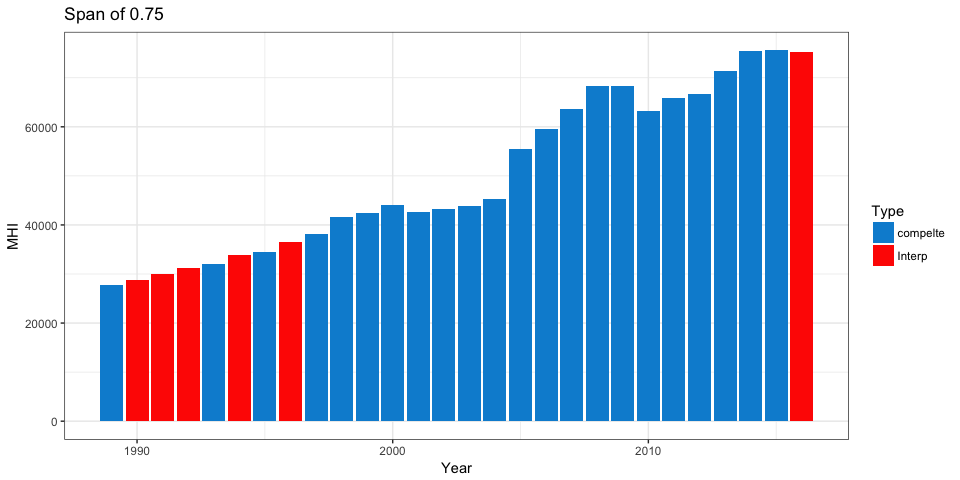
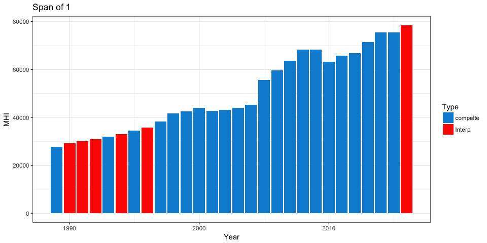

Interpolating Missing Data Using Loess
================

This script demonstrates how to interpolate missing values in a time series using a [LOESS curve](https://en.wikipedia.org/wiki/Local_regression). For demonstration purposes, we will be using Median Household Income data from the [Federal Reserve of St Louis](https://fred.stlouisfed.org/series/MHINY36061A052NCEN).

``` r
knitr::opts_chunk$set(
    message = FALSE,
    warning = FALSE,
    include = TRUE,
    fig.width = 10
)

rm(list=ls())

suppressMessages({
  library(tidyverse)
  library(stringr)
})
```

Load the data from the `data` directory. Note the missing values:

``` r
MHI_ny_county <- read_csv("data/NY County MHI through 2014.csv")

knitr::kable(head(MHI_ny_county))
```

| DATE   | MHINY36061A052NCEN |
|:-------|:-------------------|
| 1/1/89 | 27667              |
| 1/1/90 | .                  |
| 1/1/91 | .                  |
| 1/1/92 | .                  |
| 1/1/93 | 31962              |
| 1/1/94 | .                  |

Cleanse the data and replace "." with NA:

``` r
MHI_ny_county<- 
  MHI_ny_county %>% 
  rename("MHI" = MHINY36061A052NCEN) %>% 
  mutate(DATE = as.Date(DATE, format = "%d/%m/%y")
         ,Year = lubridate::year(DATE)
         ,MHI = as.numeric(str_replace(MHI,"[.]",""))
  ) %>% 
  select(Year,MHI)
```

[ACS Factfinder](https://factfinder.census.gov/faces/nav/jsf/pages/index.xhtml) gives us the 2015 MHI value. We will add that manually, as well as an empty 2016 value which we will forecast in a later step:

``` r
# from ACS:
MHI_ny_county_2015 <- data.frame("Year" = c(2015,2016), "MHI" = c(75575,NA))
MHI_ny_county <- bind_rows(MHI_ny_county, MHI_ny_county_2015)

knitr::kable(tail(MHI_ny_county))
```

|  Year|    MHI|
|-----:|------:|
|  2011|  65833|
|  2012|  66739|
|  2013|  71443|
|  2014|  75459|
|  2015|  75575|
|  2016|     NA|

Interpolate the missing values using a loess curve:

``` r
# spit into the complete and missing data sets:
empty_rows <- MHI_ny_county %>% filter(is.na(MHI))
empty_rows$Type <- "Interp"

complete_data <- MHI_ny_county %>% filter(!is.na(MHI))
complete_data$Type <- "compelte"
```

We can change the 'span' parameter to increase the flexibility of the curve.

Let's compare the default span of 0.75 to a span of 1:

``` r
f_loess <- loess(formula = MHI ~ Year
                 , span = 0.75
                 , data = complete_data
                 , control = loess.control(surface = "direct")
)

empty_rows$MHI <- round(predict(f_loess, empty_rows),0)


# recombine the data and view the results:
full_data <- bind_rows(complete_data,empty_rows)

full_data %>% 
  ggplot()+
  aes(x = Year, y = MHI, group = Type, fill = Type)+
  geom_col()+
  theme_bw()+
  ggthemes::scale_fill_fivethirtyeight()+
  labs(title = "Span of 0.75")
```



The default span interpolates the missing values nicely, but the 2016 forecast looks flat to 2015. This doesn't look quite right, so let's increase the flexibility of the loess curve a bit by increasing the span parameter:

``` r
f_loess <- loess(formula = MHI ~ Year
                 , span = 1
                 , data = complete_data
                 , control = loess.control(surface = "direct")
)

empty_rows$MHI <- round(predict(f_loess, empty_rows),0)


# recombine the data and view the results:
full_data <- bind_rows(complete_data,empty_rows)

full_data %>% 
  ggplot()+
  aes(x = Year, y = MHI, group = Type, fill = Type)+
  geom_col()+
  theme_bw()+
  ggthemes::scale_fill_fivethirtyeight()+
  labs(title = "Span of 1")
```



The span of 1 passes a qualitative check.

This approach is sound for quickly interpolating missing data. Here, we extended the technique to forcast 1 period ahead. For more sophisticated univariate forecasting, review Rob J Hyndman's [forecast](https://www.otexts.org/fpp) package in R.
